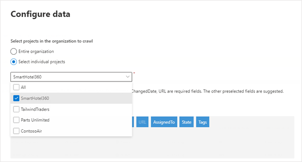
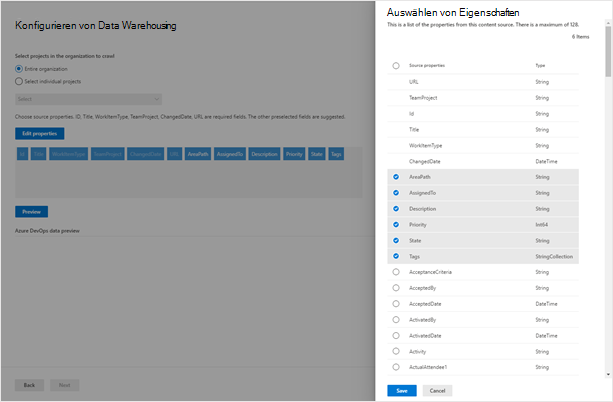

# Azure DevOps Connector (Vorschau)

Mit dem Azure DevOps-Connector kann Ihre Organisation Arbeitsaufgaben in Ihrer Instanz des Azure DevOps-Diensts indizieren. Nachdem Sie den Connector-und den Index Inhalt aus Azure DevOps konfiguriert haben, können Endbenutzer nach diesen Elementen in der Microsoft-Suche suchen.

Dieser Artikel richtet sich an Microsoft 365-Administratoren oder Personen, die einen Azure DevOps-Connector konfigurieren, ausführen und überwachen. Es wird erläutert, wie Sie die Connector-und connectorfunktionen, Einschränkungen und Techniken zur Problembehandlung konfigurieren.

>[!IMPORTANT]
>Der Azure DevOps-Connector unterstützt nur den Azure DevOps Cloud Service. Azure DevOps Server 2019, TFS 2018, TFS 2017, TFS 2015 und TFS 2013 werden von diesem Connector nicht unterstützt. 

## Herstellen einer Verbindung mit einer Datenquelle

Um eine Verbindung mit ihrer Azure DevOps-Instanz herzustellen, benötigen Sie Ihren Azure DevOps- [Organisations](https://docs.microsoft.com/azure/devops/organizations/accounts/create-organization) Namen, die APP-ID und den geheimen Client Schlüssel für die OAuth-Authentifizierung.

### Registrieren einer App

Sie müssen eine app in Azure DevOps registrieren, damit die Microsoft Search-App auf die Instanz zugreifen kann. Weitere Informationen finden Sie unter Azure DevOps-Dokumentation zum [Registrieren einer APP](https://docs.microsoft.com/azure/devops/integrate/get-started/authentication/oauth?view=azure-devops#register-your-app). 

In der folgenden Tabelle finden Sie Anleitungen zum Ausfüllen des App-Registrierungsformulars:

 **Obligatorische Felder** | **Beschreibung**      | **Empfohlener Wert** 
--- | --- | --- 
| Firmenname         | Dies ist der Name Ihres Unternehmens. | Verwenden eines geeigneten Werts   | 
| Anwendungsname     | Dieser eindeutige Wert identifiziert die Anwendung, die Sie zu autorisieren haben.    | Microsoft Search     | 
| Anwendungswebsite  | Dieses erforderliche Feld ist die URL der Anwendung, die während des Connector-Setups Zugriff auf Ihre Azure DevOps-Instanz anfordert.  | <https://gcs.office.com/>                | 
| Autorisierungs-Rückruf-URL        | Eine erforderliche Rückruf-URL, an die der autorisierungsserver umgeleitet wird. | <https://gcs.office.com/v1.0/admin/oauth/callback>| 
| Autorisierte Bereiche | Dies ist der Umfang des Zugriffs für die Anwendung. | Wählen Sie die folgenden Bereiche aus: Identity (lesen), Arbeitsaufgaben (lesen), Variablen Gruppen (lesen), Projekt und Team (lesen), Grafik (lesen)| 

Beim Registrieren der APP mit den obigen Details erhalten Sie die **App-ID** und den **geheimen Client Schlüssel** , die zum Konfigurieren des Connectors verwendet werden.

>[!NOTE]
>Um den Zugriff auf alle in Azure DevOps registrierten apps aufzuheben, wechseln Sie zu Benutzereinstellungen rechts oben in ihrer Azure DevOps-Instanz. Klicken Sie auf Profil, und klicken Sie dann im Abschnitt Sicherheit des Seitenbereichs auf Berechtigungen. Zeigen Sie mit der Maus auf eine autorisierte OAuth-APP, um die Schaltfläche Widerrufen an der Ecke der App-Details anzuzeigen.

### Verbindungseinstellungen

Nachdem Sie die Microsoft Search-App mit Azure DevOps registriert haben, können Sie den Schritt Verbindungseinstellungen durchführen. Geben Sie den Namen Ihrer Organisation, die APP-ID und den geheimen Client Schlüssel ein.

## Auswählen von Projekten und Feldern

Sie können auswählen, ob die Verbindung entweder die gesamte Organisation oder bestimmte Projekte indizieren soll.

Wenn Sie sich dafür entscheiden, die gesamte Organisation zu indizieren, werden Elemente in allen Projekten in der Organisation indiziert. Neue Projekte und Elemente werden während der nächsten Durchforstung indiziert, nachdem Sie erstellt wurden. Wenn Sie einzelne Projekte auswählen, werden nur Arbeitsaufgaben in diesen Projekten indiziert.

Wählen Sie als nächstes aus, welche Felder die Verbindung indizieren soll, und sehen Sie sich die Daten in diesen Feldern in der Vorschau an, bevor Sie fortfahren.

## Verwalten von Suchberechtigungen

Der Azure DevOps-Connector unterstützt Suchberechtigungen, die  **nur für Personen mit Zugriff auf diese Datenquelle** oder für **alle** sichtbar sind. Wenn Sie **nur Personen mit Zugriff auf diese Datenquelle** auswählen, werden indizierte Daten in den Suchergebnissen für Benutzer angezeigt, die basierend auf den Berechtigungen für Benutzer oder Gruppen auf Organisations-, Projekt-oder Bereichspfad Ebene in Azure DevOps auf diese zugreifen können. Wenn Sie **alle** auswählen, werden indizierte Daten für alle Benutzer in den Suchergebnissen angezeigt.

## Zuweisen von Eigenschaften Bezeichnungen

Sie können jeder Beschriftung eine Source-Eigenschaft zuweisen, indem Sie in einem Menü mit Optionen auswählen. Dieser Schritt ist zwar nicht zwingend erforderlich, aber einige Eigenschaften Bezeichnungen verbessern die Suchrelevanz und stellen genauere Suchergebnisse für Endbenutzer sicher.

## Schema verwalten

Auf dem Bildschirm " **Schema verwalten** " haben Sie die Möglichkeit, die den Eigenschaften zugeordneten Schema **Attribute (** abfragbar, **durchsuchbar**, **abrufbar** und **verfeinernd**) zu ändern, optionale Aliase hinzuzufügen und die **Content** -Eigenschaft auszuwählen.

## Festlegen des Aktualisierungszeitplans

Der Azure DevOps-Connector unterstützt Aktualisierungs Zeitpläne für vollständige und inkrementelle Crawls. Bei einer vollständigen Durchforstung werden gelöschte Arbeitsaufgaben gesucht, die zuvor mit dem Microsoft-Suchindex synchronisiert wurden. Eine vollständige Durchforstung wird ausgeführt, um alle Arbeitsaufgaben zu synchronisieren. Um neue Arbeitsaufgaben und Aktualisierungen an vorhandenen Arbeitsaufgaben zu synchronisieren, müssen Sie inkrementelle Durchforstungen planen.

Der empfohlene Zeitplan beträgt eine Stunde für eine inkrementelle Durchforstung und einen Tag für eine vollständige Durchforstung. 