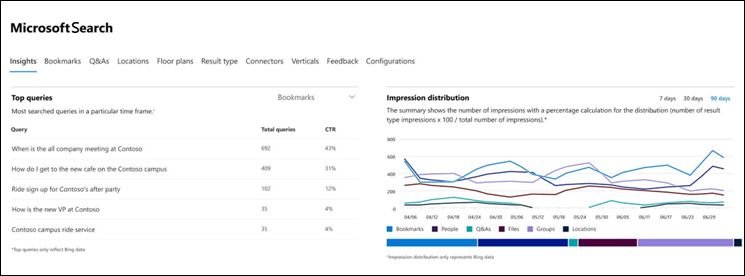

# Microsoft Search Insights Dashboard-BerichteMicrosoft Search Insights dashboard reports

Sie können das Microsoft Search Insights-Dashboard verwenden, um [Bing](https://Bing.com) -Daten für Ihre veröffentlichten Antworten zu verwalten.You can use the Microsoft Search Insights dashboard to manage [Bing](https://Bing.com) data for your published answers. Dies ist nur einer der Schritte, die erforderlich sind, um die [Suche nach Inhalten](make-content-easy-to-find.md) für Ihre Benutzer zu vereinfachen.This is just one of the steps needed to [make content easy to find](make-content-easy-to-find.md) for your users.

Wenn Sie zum ersten Mal im Microsoft 365 [Admin Center](https://admin.microsoft.com)zu Microsoft Search wechseln, geben Sie das Einblicke-Dashboard ein.When you first go to Microsoft Search in the Microsoft 365 [admin center](https://admin.microsoft.com), you enter on the Insights dashboard.

Die folgenden Berichte sind im Insights-Dashboard verfügbar.The following reports are available on the Insights dashboard.

> [!NOTE]
> Die Daten in den Berichten stellt nur [Bing](https://Bing.com) -Daten dar.The data in the reports only represents [Bing](https://Bing.com) data.

## Häufigste SuchvorgängeTop queries

Dieser Bericht enthält Details zu den häufigsten 2000 [Bing](https://Bing.com) -Suchabfragen, die von Benutzern ausgeführt werden.This report gives details about the top 2000 [Bing](https://Bing.com) search queries that users run. Damit eine Abfrage in Top- **Abfragen**angezeigt wird, muss die Abfrage mindestens drei Klicks erhalten.For a query to appear in **Top queries**, the query must get at least three clicks.

Eine niedrige Klickrate (Click-through Rate) bedeutet, dass Benutzer nicht nach Ihren Wünschen suchen.A low click-through rate (CTR) means that users aren’t finding what they’re looking for.

Sie können verschiedene Ansichten des Berichts auswählen, indem Sie nach dem Typ der Antwort filtern.You can choose different views of the report by filtering on the type of answer. Wenn Sie beispielsweise nur die häufigsten Abfragen für Textmarken anzeigen möchten, wählen Sie die Dropdownliste in der oberen rechten Ecke des Berichts aus, und wählen Sie dann **Lesezeichen**aus.For example, if you just want to view the top queries for Bookmarks, select the drop-down in the upper-right corner of the report, and then select **Bookmarks**. Standardmäßig werden **alle** Antworttypen angezeigt.By default, **All** answer types are shown.

## Impression-VerteilungImpression distribution

In diesem Bericht wird die Druckverteilung in [Bing](https://Bing.com) im Laufe der Zeit für verschiedene Antworten dargestellt.This report shows impression distribution in [Bing](https://Bing.com) over time for various answers. Beispiele sind Lesezeichen, Personen, Q&A, Dateien, Speicherorte, Datei Websites, Gruppen und Unterhaltungen.Examples are bookmarks, people, Q&A, files, locations, file sites, groups, and conversations. 

Die Impression-Verteilung kann Administratoren helfen zu verstehen, was Benutzer während eines bestimmten Zeitraums suchen.Impression distribution can help admins understand what users look for during a specified period.
