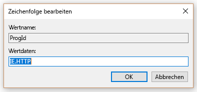

# Festlegen des StandardbrowsersSet default browser

> [!IMPORTANT]
> Dieser Artikel bezieht sich auf Microsoft Search im Bing-Verwaltungsportal.This article applies to the Microsoft Search in Bing admin portal. Wir verschieben das Portal zum Microsoft 365 Admin Center, und dann wird es entfernt.We’re moving the portal to the Microsoft 365 admin center, and then it will be removed. Es wird empfohlen, dass Sie zu Beginn das Microsoft 365 Admin Center verwenden.We recommend that you use the Microsoft 365 admin center to get started. [Übersicht über Microsoft Search](overview-microsoft-search.md).Overview of Microsoft Search
    
Das Konfigurieren des Standardbrowsers, der Standardsuchmaschine und der standardmäßigen Startseite hilft Ihren Benutzern, die Microsoft Search-Funktionen zu entdecken, fördert deren Verwendung und ermöglicht eine gleichmäßigere Erfahrung.Configuring the default browser, default search engine, and default homepage will help your users discover Microsoft Search capabilities, encourage more usage, and provide a smoother experience.
  
Führen Sie zum Festlegen des Standardbrowsers für Ihre Organisation die folgenden Schritte aus.To set the default browser for your organization, follow the steps below.
  
## Windows 8 und höherWindows 8 and above

Wenn Sie Internet Explorer oder Microsoft Edge als Standardbrowser festlegen möchten, gehen Sie wie folgt vor:To set Internet Explorer or Microsoft Edge as the default browser, follow these steps:
  
### Erstellen der StandardzuordnungsdateiCreate default associations file

1. Öffnen Sie eine PowerShell-Konsole.Open an administrative PowerShell console.
    
2.  `New-Item -Path "\\$env:USERDOMAIN\SYSVOL\$env:USERDNSDOMAIN" -Type Directory -Name "Settings"`
    
3.  `$SettingsPath="\\$env:USERDOMAIN\SYSVOL\$env:USERDNSDOMAIN\Settings"`
    
4.  `Start-Process Dism.exe -PassThru "/Online /Export-DefaultAppAssociations:$SettingsPath\AppAssoc.xml"`
    
Diese Schritte testen und erstellen die Standardzuordnungsdatei im Ordner „SYSVOL“ des Domänencontrollers.These steps try and create the default associations file in the SYSVOL folder of the domain controller.
  
### Hinzufügen oder Bearbeiten der StandardzuordnungsdateiAdd or edit the default associations file

1. `Notepad "$SettingsPath\AppAssoc.xml"`
    
2. Bearbeiten Sie die folgenden Einträge (.htm, .html, http, https), und entfernen Sie die anderen Einträge, wenn sie nicht benötigt werden.Edit the following entries (.htm, .html, http, https), and remove other entries if they're not needed.
    
  - **Microsoft Edge****Microsoft Edge**
    
     `<Association Identifier=".htm" ProgId="AppX4hxtad77fbk3jkkeerkrm0ze94wjf3s9" ApplicationName="Microsoft Edge" />`
  
     `<Association Identifier=".html" ProgId="AppX4hxtad77fbk3jkkeerkrm0ze94wjf3s9" ApplicationName="Microsoft Edge" />`
  
     `<Association Identifier="http" ProgId="AppXq0fevzme2pys62n3e0fbqa7peapykr8v" ApplicationName="Microsoft Edge" />`
    
  - **Internet Explorer****Internet Explorer**
    
     `<Association Identifier=".htm" ProgId="htmlfile" ApplicationName="Internet Explorer" />`
  
     `<Association Identifier=".html" ProgId="htmlfile" ApplicationName="Internet Explorer" />`
  
     `<Association Identifier="http" ProgId="IE.HTTP" ApplicationName="Internet Explorer" />`
  
     `<Association Identifier="https" ProgId="IE.HTTPS" ApplicationName="Internet Explorer" />`
    
3. Öffnen Sie die Gruppenrichtlinien-Verwaltungskonsole (gpmc.msc), und wechseln Sie zum Bearbeiten einer vorhandenen Richtlinie oder zum Erstellen einer neuen.Open Group Policy Management Console (gpmc.msc) and switch to editing any existing policy or creating a new one.
    
1. Navigieren Sie zu **Computerkonfiguration\Administrative Vorlagen\Windows-Komponenten\Datei-Explorer**Navigate to **Computer Configuration\Administrative Templates\Windows Components\File Explorer**
    
2. Doppelklicken Sie auf **Konfigurationsdatei für Standardzuordnungen festlegen**, legen Sie es auf **Aktiviert** fest, und geben Sie den Pfad zu AppAssoc.xml (z. B. %USERDOMAIN%\SYSVOL\%USERDNSDOMAIN%\Settings\AppAssoc.xml) ein.Double-click **Set a default associations configuration file**, set it to **Enabled**, and enter the path to AppAssoc.xml (for example %USERDOMAIN%\SYSVOL\%USERDNSDOMAIN%\Settings\AppAssoc.xml)
    
4. Erzwingen das resultierende GPO, indem Sie es mit der entsprechenden Domäne verknüpfen.Enforce the resultant GPO by linking it to the appropriate domain.
    
Benutzer können den Browser ändern, nachdem diese Richtlinie festgelegt ist.Users will be able to change the browser after this policy is set.
  
## Windows 7Windows 7

1. Konfigurieren Sie den lokalen Computer, der verwendet wird, um das Gruppenrichtlinienobjekt festlegen.Configure the local machine that will be used to set the GPO.
    
1. Öffnen Sie **Systemsteuerung\Programme\Standardprogramme\Standardprogramme festlegen**, und legen Sie Internet Explorer als Standard fest.Open **Control Panel\Programs\Default Programs\Set Default Programs** and set Internet Explorer as the default. 
    
2. Öffnen Sie die Gruppenrichtlinien-Verwaltungskonsole (gpmc.msc), und wechseln Sie zum Bearbeiten einer vorhandenen Richtlinie oder zum Erstellen einer neuen.Open Group Policy Management Console (gpmc.msc) and switch to editing any existing policy or creating a new one.
    
1. Navigieren Sie zu \*\* \<Computer/Benutzer\> Konfiguration\Richtlinien\Einstellungen\Windows-Einstellungen\*\*.Navigate to **\<Computer/User\> Configuration\Policies\Preferences\Windows Settings**.
    
2. Klicken Sie mit der rechten Maustaste auf **Registrierung\Neu**, und wählen Sie **Registrierungs-Assistent** aus.Right-click on **Registry\New** and select **Registry Wizard**.
    
3. Wählen Sie im Fenster „Registrierungsbrowser“ die Option **Lokaler Computer** aus, und klicken Sie auf **Weiter**.From the Registry Browser window, select **Local Computer** and click **Next**.
    
4. Navigieren Sie zu **HKEY_CURRENT_USER\Software\Microsoft\Windows\Shell\Associations\UrlAssociations\https**, und wählen Sie den Wert „ProgId“ aus. Stellen Sie sicher, dass der Wert wie folgt aussieht:Navigate to **HKEY_CURRENT_USER\Software\Microsoft\Windows\Shell\Associations\UrlAssociations\https** and select the ProgId value. Make sure the value looks like the one below: 
    
    
  
5. Navigieren Sie zu **HKEY_CURRENT_USER\Software\Microsoft\Windows\Shell\Associations\UrlAssociations\https**, und wählen Sie den Wert „ProgId“ aus. Stellen Sie sicher, dass der Wert wie folgt aussieht:Navigate to **HKEY_CURRENT_USER\Software\Microsoft\Windows\Shell\Associations\UrlAssociations\https** and select the ProgId value. Make sure that the value looks like the one below: 
    
    
  
3. Erzwingen das resultierende GPO, indem Sie es mit der entsprechenden Domäne verknüpfen.Enforce the resultant GPO by linking it to the appropriate domain.
    
Benutzer können den Browser ändern, nachdem diese Richtlinie festgelegt ist.Users will be able to change the browser after this policy is set.