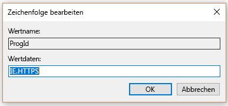

# Festlegen von Microsoft Edge als Standardbrowser
  
Um Ihren Benutzern die optimale Erfahrung mit Microsoft Search zu bieten, können Sie Microsoft Edge als Standardbrowser festlegen. Damit wird Microsoft Edge nur als Standardbrowser für Benutzer in Ihrer Organisation festgelegt. Einzelne Benutzer können weiterhin einen anderen Browser auswählen.
  
  
## Windows 8 und höher

In diesen Anweisungen wird gezeigt, wie Sie Microsoft Edge oder Internet Explorer als Standardbrowser für Computer unter Windows 8 oder höher festlegen. Benutzer können den Browser ändern, nachdem diese Richtlinie festgelegt ist.
  
### SCHRITT 1: Erstellen der Standardzuordnungsdatei
Erstellen Sie die Standardzuordnungsdatei im Ordner "SYSVOL" des Domänencontrollers.

1. Öffnen Sie eine PowerShell-Konsole.
1. `New-Item -Path "\\$env:USERDOMAIN\SYSVOL\$env:USERDNSDOMAIN" -Type Directory -Name "Settings"`
1. `$SettingsPath="\\$env:USERDOMAIN\SYSVOL\$env:USERDNSDOMAIN\Settings"`
1. `Start-Process Dism.exe -PassThru "/Online /Export-DefaultAppAssociations:$SettingsPath\AppAssoc.xml"`
    
  
### SCHRITT 2: Hinzufügen oder Bearbeiten der Standardzuordnungsdatei

1. `Notepad "$SettingsPath\AppAssoc.xml"`
1. Bearbeiten Sie die folgenden Einträge (.htm, .html, http, https), und entfernen Sie die anderen Einträge, wenn sie nicht benötigt werden.
  - **Microsoft Edge**
    - `<Association Identifier=".htm" ProgId="AppX4hxtad77fbk3jkkeerkrm0ze94wjf3s9" ApplicationName="Microsoft Edge" />`
              
    - `<Association Identifier=".html" ProgId="AppX4hxtad77fbk3jkkeerkrm0ze94wjf3s9" ApplicationName="Microsoft Edge" />`
    - `<Association Identifier="http" ProgId="AppXq0fevzme2pys62n3e0fbqa7peapykr8v" ApplicationName="Microsoft Edge" />`
    
  - **Internet Explorer**
    
    - `<Association Identifier=".htm" ProgId="htmlfile" ApplicationName="Internet Explorer" />`        
    - `<Association Identifier=".html" ProgId="htmlfile" ApplicationName="Internet Explorer" />`
    - `<Association Identifier="http" ProgId="IE.HTTP" ApplicationName="Internet Explorer" />`
    - `<Association Identifier="https" ProgId="IE.HTTPS" ApplicationName="Internet Explorer" />`

### SCHRITT 3: Bearbeiten der Gruppenrichtlinien

1. Öffnen Sie die **Gruppenrichtlinien-Verwaltungskonsole** (gpmc.msc), und wechseln Sie zum Bearbeiten einer vorhandenen Richtlinie oder zum Erstellen einer neuen.
1. Navigieren Sie zu **Computerkonfiguration\Administrative Vorlagen\Windows-Komponenten\Datei-Explorer**.
1. Doppelklicken Sie auf **Konfigurationsdatei für Standardzuordnungen festlegen**, legen Sie es auf **Aktiviert** fest, und geben Sie den Pfad zu AppAssoc.xml (z. B. %USERDOMAIN%\SYSVOL\%USERDNSDOMAIN%\Settings\AppAssoc.xml) ein.Erzwingen Sie das resultierende GPO, indem Sie es mit der entsprechenden Domäne verknüpfen.

  
## Windows 7

1. Konfigurieren Sie den lokalen Computer, der verwendet wird, um das Gruppenrichtlinienobjekt festlegen.
    
1. Öffnen Sie **Systemsteuerung\Programme\Standardprogramme\Standardprogramme festlegen**, und legen Sie Internet Explorer als Standard fest. 
    
2. Öffnen Sie die Gruppenrichtlinien-Verwaltungskonsole (gpmc.msc), und wechseln Sie zum Bearbeiten einer vorhandenen Richtlinie oder zum Erstellen einer neuen.
    
1. Navigieren Sie zu ** \<Computer/Benutzer\> Konfiguration\Richtlinien\Einstellungen\Windows-Einstellungen**.
    
2. Klicken Sie mit der rechten Maustaste auf **Registrierung\Neu**, und wählen Sie **Registrierungs-Assistent** aus.
    
3. Wählen Sie im Fenster „Registrierungsbrowser“ die Option **Lokaler Computer** aus, und klicken Sie auf **Weiter**.
    
4. Navigieren Sie zu **HKEY_CURRENT_USER\Software\Microsoft\Windows\Shell\Associations\UrlAssociations\https**, und wählen Sie den Wert „ProgId“ aus. Stellen Sie sicher, dass der Wert wie folgt aussieht: 
    
    
  
5. Navigieren Sie zu **HKEY_CURRENT_USER\Software\Microsoft\Windows\Shell\Associations\UrlAssociations\https**, und wählen Sie den Wert „ProgId“ aus. Stellen Sie sicher, dass der Wert wie folgt aussieht: 
    
    
  
3. Erzwingen das resultierende GPO, indem Sie es mit der entsprechenden Domäne verknüpfen.
    
