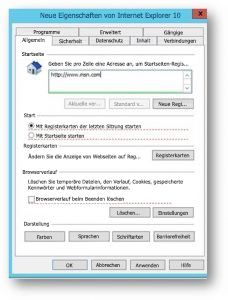

# Set-Standard-homepage

Konfigurieren der Standard-Browser, Standard-Suchmaschine und Standard-Homepage helfen Ihre Benutzer entdecken Sie Microsoft Search-Funktionen, weitere Verwendung fördern und bieten einen reibungsloseren.
  
Wenn die Standard-Homepage für Ihre Organisation festlegen möchten, führen Sie die folgenden Schritte aus.
  
## Internet Explorer

### InternetExplorer 5.0 oder höher

1. Öffnen Sie die Gruppenrichtlinien-Verwaltungskonsole (gpmc.msc), und wechseln Sie zum Erstellen einer neuen oder bearbeiten die vorhandene Richtlinie.
    
2. Navigieren Sie zu **Einstellungen für den Benutzer Configuration\Preferences\Control Dokumentinformationsbereich Einstellungen\Internet**.
    
3. Mit der rechten Maustaste auf **Internet-Einstellungen** , und wählen Sie **Internet Explorer 10**.
    
    > [!NOTE]
    > Sie müssen die Option von Internet Explorer 10 Anwendung die Einstellungen für Internet Explorer 11, wie die gleichen Einstellungen für Internet Explorer 11 gelten. 
  
4. Einstellungen der rot unterstrichen werden sind nicht auf dem Zielcomputer konfiguriert, während auf dem Zielcomputer Grün unterstrichene Einstellungen konfiguriert werden. Um die Unterstreichung zu ändern, verwenden Sie die folgenden Funktionstasten:
    
    F5 - alle Einstellungen auf der aktuellen Registerkarte aktivieren
    
    F6 - Aktivieren der aktuell ausgewählten Einstellung
    
    F7 - der aktuell ausgewählten Einstellung deaktivieren
    
    F8 - alle Einstellungen auf der aktuellen Registerkarte deaktivieren
    
5. Drücken Sie **F8** , um alle Einstellungen, die vor dem Konfigurieren von Suchzeichenfolge deaktivieren. Der Bildschirm sollte wie folgt aussehen: 
    
    
  
6. Drücken Sie **F6,** auf der Homepage und geben Sie`https://www.bing.com/business?form=BFBSPR`
    
7. Erzwingen Sie das resultierende GPO durch Verknüpfung mit der entsprechenden Domäne.
    
> [!NOTE]
> Benutzer können weiterhin die Homepage ändern, nachdem diese Richtlinie festgelegt ist. 
  
## Microsoft Edge

### Windows-10, Version 1511 oder höher

1. Öffnen Sie die Gruppenrichtlinien-Verwaltungskonsole (gpmc.msc), und wechseln Sie zum Erstellen einer neuen oder bearbeiten die vorhandene Richtlinie.
    
2. Navigieren Sie zu **Administrative Vorlagen\Windows-Komponenten\Microsoft Edge**
    
1. Doppelklicken Sie auf **Seiten starten konfigurieren**, legen Sie es auf **aktiviert**, und geben`https://www.bing.com/business`
    
3. Erzwingen Sie das resultierende GPO durch Verknüpfung mit der entsprechenden Domäne.
    
> [!CAUTION]
> Benutzer möglich nicht Suchanbieter ändern, nachdem diese Richtlinie festgelegt ist. 
  
## Google Chrome

### Windows XP SP2 oder höher

Im Windows-Artikel zur Verwaltung von ADMX-Dateien und die neuesten ADMX-Dateien für die verschiedenen Versionen von Windows finden Sie [auf der Microsoft-Supportmitarbeiter](https://support.microsoft.com/en-us/help/3087759/how-to-create-and-manage-the-central-store-for-group-policy-administra).

Sie benötigen auch die neuesten Google Richtliniendatei, die finden Sie auf [Hilfe zu Google Chrome Enterprise](https://support.google.com/chrome/a/answer/187202)können.
  
Wenn die Einstellungen in diesem Abschnitt beschriebenen innerhalb der Gruppenrichtlinien-Verwaltungskonsole nicht gefunden werden können, laden Sie das entsprechende ADMX, und kopieren Sie sie an den [zentralen Speicher](https://docs.microsoft.com/en-us/previous-versions/windows/it-pro/windows-vista/cc748955%28v%3dws.10%29). Zentralen Speicher auf dem Domänencontroller ist ein Ordner mit der folgenden Benennungskonvention:
  
 **%systemroot%\sysvol\\<domain\>\policies\PolicyDefinitions**
  
Jede Domäne sollte die Controller Handles einen gesonderten Ordner abrufen. Der folgende Befehl kann verwendet werden, zum Kopieren von ADMX-Datei von der Befehlszeile aus:
  
 `Copy <path_to_ADMX.ADMX> %systemroot%\sysvol\<domain>\policies\PolicyDefinitions`
  
1. Öffnen Sie die Gruppenrichtlinien-Verwaltungskonsole (gpmc.msc), und wechseln Sie zum Erstellen einer neuen oder bearbeiten die vorhandene Richtlinie.
    
2. Stellen Sie sicher, dass die folgenden Ordner angezeigt werden, im Abschnitt **Administrative Vorlagen** des beide *Benutzer/Computerkonfiguration*: Google Chrome und Google Chrome - Default Settings (vom Benutzer überschreibbar).
    
   - Die Einstellungen des ersten Abschnitts behoben werden, und der lokale Administrator wird nicht in der Lage, sie zu ändern.
    
   - Die Einstellungen des zweiten Abschnitts der Richtlinien können von Benutzern in ihrer Browsereinstellungen geändert werden. Sie sollten entscheiden, ob Benutzer die Standardeinstellung außer Kraft setzen können. Ändern Sie in den folgenden Schritten in den Ordner, der entspricht der Einstellung für Ihre Organisationsrichtlinie und Anforderungen. In den nachfolgenden Schritten verwenden die Google Chrome - Standardeinstellungen als Standard.
    
3. Navigieren Sie zu ** &lt;Computer/Benutzerkonfiguration&gt;\Administrative Templates\Google Chrome - Standardseite Settings\Home**.
    
4. Doppelklicken Sie auf **Neue Registerkartenseite als Homepage verwenden**, und legen sie auf **aktiviert**.
    
5. Navigieren Sie zu ** &lt;Computer/Benutzerkonfiguration&gt;\Administrative Templates\Google Chrome - Standardseite Settings\New-Registerkarte**.
    
6. Doppelklicken Sie auf **die URL für die neue Registerkarte Konfigurieren**, legen Sie es auf **aktiviert**, und geben`https://www.bing.com/business?form=BFBSPR`
    
7. Erzwingen Sie das resultierende GPO durch Verknüpfung mit der entsprechenden Domäne.
    
Benutzer können auf der Homepage des ändern, nachdem diese Richtlinie festgelegt ist.