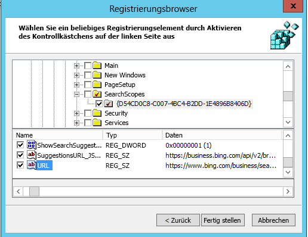

# Festlegen der Standardsuchmaschine

Das Konfigurieren des Standardbrowsers, der Standardsuchmaschine und der standardmäßigen Startseite hilft Ihren Benutzern, die Microsoft Search-Funktionen zu entdecken, fördert deren Verwendung und ermöglicht eine gleichmäßigere Erfahrung.
  
Führen Sie zum Festlegen der Standardsuchmaschine für Ihre Organisation die folgenden Schritte aus.
  
## Internet Explorer

### Internet Explorer 11

Benutzer können den Suchanbieter ändern, nachdem diese Richtlinie festgelegt wurde.
  
#### 1. Konfigurieren Sie den lokalen Computer, der verwendet wird, um das Gruppenrichtlinienobjekt festzulegen.

Fügen Sie den folgenden Text in eine REG-Datei (\*.reg) ein.
  
Windows-Registrierungs-Editor, Version 5.00
  
<pre>[HKEY_CURRENT_USER\Software\Microsoft\Internet Explorer\SearchScopes]
"DefaultScope"="{D54CD0C8-C007-4BC4-B2DD-1E4896B8406D}"
[HKEY_CURRENT_USER\Software\Microsoft\Internet Explorer\SearchScopes\{D54CD0C8-C007-4BC4-B2DD-1E4896B8406D}]
"Codepage"=dword:0000fde9
"DisplayName"="Microsoft Search in Bing"
"OSDFileURL"="https://www.bing.com/sa/osd/bfb.xml"
"FaviconURL"="https://www.bing.com/sa/simg/bb.ico"
"SuggestionsURL_JSON"="https://business.ing.com/api/v2/browser/suggest?q={searchTerms}&amp;form=BFBSPA"
"ShowSearchSuggestions"=dword:00000001
"URL"="https://www.bing.com/business/search?q={searchTerms}&amp;form=BFBSPR"</pre>
  
Doppelklicken Sie auf die erstellte Datei, und befolgen Sie die Schritte zum Importieren der Datei. Nach einem erfolgreichen Import wird der folgende Dialog angezeigt:
  

  
#### 2. Öffnen Sie die Gruppenrichtlinien-Verwaltungskonsole (gpmc.msc), und wechseln Sie zum Bearbeiten einer vorhandenen Richtlinie oder zum Erstellen einer neuen.

1. Navigieren Sie zu **Benutzerkonfiguration\Richtlinien\Einstellungen\Windows-Einstellungen**.
    
2. Klicken Sie mit der rechten Maustaste auf **Registrierung\Neu** und **Registrierungsassistent**. Wählen Sie im Fenster "Registrierungsbrowser" **Lokaler Computer**, und klicken Sie auf **Weiter**.
    
3. Navigieren Sie zu **HKEY_CURRENT_USER\SOFTWARE\Microsoft\Internet Explorer\SearchScopes**.
    
4. Wählen Sie aus diesem Schlüssel DefaultScope aus.
    
    
  
5. Überprüfen Sie alle untergeordneten Schlüssel, die die GUID für Microsoft Search in Bing enthalten, und jeden Wert unter dem Schlüssel mit Ausnahme von Pfaden zu Benutzerprofilen. Scrollen Sie nach unten, um weitere Elemente auszuwählen.
    
    
  
6. Klicken Sie auf Fertig stellen, um die Konfiguration abzuschließen.
    
#### 3. Einrichten von Benutzereinstellungen, um eine Warnung zu vermeiden, die der Benutzer erhalten kann, wenn die DefaultScope-Suche erzwungen wird

Diese Warnung warnt Benutzer eines Programmes davor, ihre Einstellungen zu ändern.
  
1. Klicken Sie im gleichen Gruppenrichtlinienobjekt mit der rechten Maustaste auf **Registrierung\Neu**, und wählen Sie **Registrierungsassistent** aus.
    
2. Navigieren Sie zu **HKEY_CURRENT_USER\SOFTWARE\Microsoft\Internet Explorer\User Preferences**.
    
3. Wählen Sie den Schlüssel **Benutzereinstellung**.
    
4. Klicken Sie auf **Fertig stellen**.
    
5. Klicken Sie auf das neu erstellte Objekt. Doppelklicken Sie im Bereich rechts auf das Benutzereinstellungen-Objekt, und ändern Sie die **Aktion** in **Löschen und Speichern**.
    
Erzwingen Sie das resultierende GPO, indem Sie es mit der entsprechenden Domäne verknüpfen.
  
## Microsoft Edge

### Windows 10, Version 1703 oder höher

Benutzer können den Suchanbieter ändern, nachdem diese Richtlinie festgelegt wurde.
  
Die neuesten ADMX-Dateien für verschiedene Windows-Versionen finden Sie unter [Erstellen und Verwalten des zentralen Speichers für administrative Vorlagen für Gruppenrichtlinien unter Windows](https://support.microsoft.com/de-DE/help/3087759/how-to-create-and-manage-the-central-store-for-group-policy-administra).
  
Wenn die in diesem Abschnitt beschriebene Einstellung nicht in der Gruppenrichtlinien-Verwaltungskonsole gefunden werden kann, laden Sie die entsprechende ADMX-Dateien herunter, und kopieren Sie sie in den zentralen Speicher. Weitere Informationen finden Sie unter [Bearbeiten von domänenbasierten Gruppenrichtlinienobjekten mithilfe von ADMX-Dateien](https://docs.microsoft.com/de-DE/previous-versions/windows/it-pro/windows-vista/cc748955%28v%3dws.10%29). Der zentrale Speicherort auf dem Controller ist ein Ordner mit der folgenden Benennungskonvention:
  
 **%systemroot%\sysvol\\<domain\>\policies\PolicyDefinitions**
  
Jede Domäne, die Ihr Controller verarbeitet, sollte einen separaten Ordner erhalten. Mit dem folgenden Befehl kann die ADMX-Datei aus der Befehlszeile kopiert werden:
  
 `Copy <path_to_ADMX.ADMX> %systemroot%\sysvol\<domain>\policies\PolicyDefinitions`
  
1. Öffnen Sie die Gruppenrichtlinien-Verwaltungskonsole (gpmc.msc), und wechseln Sie zum Bearbeiten einer vorhandenen Richtlinie oder zum Erstellen einer neuen.
    
2. Navigieren Sie zu **&lt;Computer/Benutzerkonfiguration&gt;\Administrationsvorlagen\Windows-Komponenten\Microsoft Edge**.
    
1. Doppelklicken Sie auf **Festlegen der Standardsuchmaschine**, wählen Sie **Aktiviert** aus, und geben Sie `https://www.bing.com/sa/osd/bfb.xml` ein.
    
3. Erzwingen Sie das resultierende GPO, indem Sie es mit der entsprechenden Domäne verknüpfen.
    
## Google Chrome

### Windows XP SP2 oder höher

Benutzer können den Suchanbieter nicht mehr ändern, nachdem diese Richtlinie festgelegt wurde.
  
Chrome verfügt über eigene Gruppenrichtlinien, die in Form einer ADMX-Datei über [Hilfe zu Google Chrome Enterprise](https://support.google.com/chrome/a/answer/187202) heruntergeladen werden können. Wenn die Betriebssysteme Windows Vista/Server ab Version 2008 verwendet werden, um das Gruppenrichtlinienobjekt für die Domäne zu verwalten, stellt die ADMX-Datei dieses Pakets die Chrome-Einstellungen unter Windows XP SP2 oder höher bereit.
  
Kopieren Sie die Vorlagendatei in einen zentralen Speicher für ADMX-Dateien auf dem Domänencontroller. Weitere Informationen finden Sie unter [Bearbeiten domänenbasierter Gruppenrichtlinienobjekte mithilfe von ADMX-Dateien](https://docs.microsoft.com/de-DE/previous-versions/windows/it-pro/windows-vista/cc748955%28v%3dws.10%29). Ein zentraler Speicher auf dem Domänencontroller ist ein Ordner mit der folgenden Benennungskonvention:
  
 **%systemroot%\sysvol\\<domain\>\policies\PolicyDefinitions**
  
Jede Domäne, die Ihr Controller verarbeitet, sollte einen separaten Ordner erhalten. Mit dem folgenden Befehl kann die ADMX-Datei aus der Befehlszeile kopiert werden:
  
 `Copy <path_to_Chrome.ADMX> %systemroot%\sysvol\<domain>\policies\PolicyDefinitions`
  
1. Öffnen Sie die Gruppenrichtlinien-Verwaltungskonsole (gpmc.msc), und wechseln Sie zum Bearbeiten einer vorhandenen Richtlinie oder zum Erstellen einer neuen.
    
2. Stellen Sie sicher, dass die folgenden Ordner im Abschnitt Administrationsvorlagen der Benutzer- und Computerkonfiguration angezeigt werden: Google Chrome und Google Chrome - Standardeinstellungen.
    
  - Die Einstellungen des ersten Abschnitts wurden festgelegt, und lokale Administratoren können sie nicht im Browser ändern.
    
  - Die Einstellungen im nachfolgenden Abschnitt der Richtlinien können von Benutzern in den Browsereinstellungen geändert werden.
    
3. Navigieren Sie zu **\<Computer/Benutzer\>Konfiguration\Administrationsvorlagen\Google Chrome\Standardsuchanbieter**.
    
4. Doppelklicken Sie auf **Aktivieren des Standardsuchanbieters**, und wählen Sie **Aktiviert** aus.
    
5. Doppelklicken Sie auf das **Standardsuchanbieter-Symbol**, wählen Sie **Aktiviert** aus, und geben Sie `https://www.bing.com/sa/simg/bb.ico` ein.
    
6. Doppelklicken Sie auf die **Standardsuchanbieter-Instant-URL**, und geben Sie `https://www.bing.com/business/search?q={searchTerms}&amp;form=BFBSPR` ein.
    
7. Doppelklicken Sie auf den **Standardsuchanbieter-Namen**, wählen Sie Aktiviert aus, und geben Sie „Microsoft Search in Bing“ ein.
    
8. Doppelklicken Sie auf die **Standardsuchanbieter-Such-URL**, wählen Sie **Aktiviert** aus, und geben Sie `https://www.bing.com/business/search?q={searchTerms}&amp;form=BFBSPR` ein.
    
9. Doppelklicken Sie auf die **Standardsuchanbieter-Vorschlags-URL**, wählen Sie **Aktiviert** aus, und geben Sie `https://business.bing.com/api/v2/browser/suggest?q={searchTerms}&amp;form=BFBSPA` ein.
    
10. Erzwingen Sie das resultierende GPO, indem Sie es mit der entsprechenden Domäne verknüpfen.
    
Wenn Sie die Standardsuchmaschine festlegen, wird das Microsoft Search-Feature „Suchvorschläge“ zur Adressleiste des Browsers hinzugefügt. Momentan werden nur Lesezeichen unterstützt. Wenn der Benutzer etwas in die Adressleiste eingibt, werden die oberen beiden Lesezeichenvorschläge über den Vorschlägen der öffentlichen Websites angezeigt.